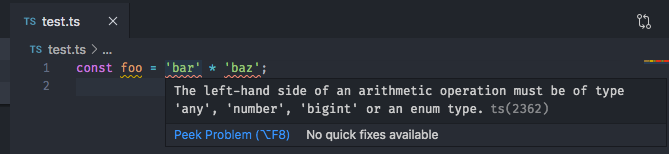

Before we begin calibrating the bot, you should have an understanding of how the tools we have here work. Feel free to skip any parts that you may know already, and you can skip to [here](tutorial-calibrate.html) if you already know how `npm`, `yarn` and `tsc` work.

## NPM

NPM (Node Package Manager) is a tool and service for easily hosting JavaScript modules. It is also the main build tool for NodeJS, and comes with some handy commands along with some that I've made myself.

### Scripts

If you look in `package.json`, you'll see a `scripts` section that looks something like this:

```json
  "scripts": {
    "check": "gts check",
    "clean": "gts clean",
    // ...etc
  },
```

These are commands that you can run using `npm run`, and they will run the script. For example, if I wanted to rebuild this documentation, I'd do:

```bash
> npm run docs
```

...which would run the corresponding script in the `package.json`

### Packages/modules

If you try and build this project right after cloning it, you'd see something like

```bash
> yarn start # or npm run start
Uncaught Error: Cannot find module 'http'
# or if you don't have tsc
Unknown command: tsc
```

This is because you need to install all of the modules with `npm install` (we'll talk about using `yarn` later). Once you do that, you'll be greeted with sweet, sweet satisfaction:

```bash
> gts fix
version: 12
No errors or warnings found
>
```

> But there's a lot of references to this thing called 'Yarn' in the scripts, what's that about?

## Yarn

NPM is great, because it keeps all of your modules and packages in a neat folder called `node_modules` at the root of your project. But a downside is that if you were to install the _same_ modules in a different project, NPM would download all of them again.

Yarn fixes that problem, and a bunch of other problems that NPM has.

By the looks of it, one would assume that `yarn` is just NPM with a couple of changes, and you wouldn't be wrong.

Yarn does a lot of stuff behind the scenes, such as caching modules in a global directory while still copying them to `node_modules/`, among other things like a nicer UI and progress bars, more descriptive errors and logs, and the ability to run binaries and scripts by prefacing them with yarn. I mean, look at these and tell me which one is better.

```bash
# Install modules in package.json
npm install
# or?
yarn

# Add a new module
npm install express
# or?
yarn add express

# Run a script in package.json
npm run compile
# or?
yarn compile

# Run a binary from node_modules
node_modules/typescript/bin/tsc
# or?
yarn tsc
```

> Well, `yarn` definitely looks more user-friendly and easier to use than `npm`

Combine that with downloads miles quicker than NPM, and you've got a great package manager on your hands :D

### TypeScript

> So, there are some files in `src/`, and they have a .ts extension, but they look similar to JS files. Whats up with that?

To quote their website:

> _TypeScript is a typed superset of JavaScript that compiles to plain JavaScript._
>
> _Any browser. Any host. Any OS. Open source._
>
> \- [TS Website](typescriptlang.org)

Essentially, TS is a language that allows you to specify the **types** of variables for some nice benefits, such as showing errors before runtime and allowing for less mistakes.

For example, this:

```js
const foo = 'bar' * 'baz';
```

...would cause an error in runtime. Something like `Can't do arithmetic on string` or the like. But your editor would never tell you that, and you'd only find out _after_ you went through the process of minifying your code, compressing it, serving it to a user and have them tell you that a login button isn't working.

But with typescript, this would happen:



That's right - while you're typing, the editor can tell you that what you've done won't run in JS.

You can also add types in TS, which allows you to make sure this doesn't happen:

```ts
const raise = function (x: number, y: number): number {
  return x ** y;
};

raise(12, 'foo'); // your editor would yell at you right about now
```
